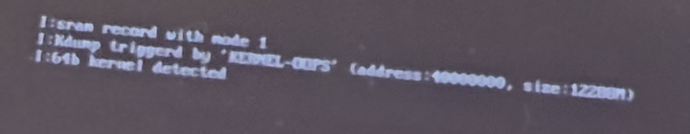

### 这篇记录其实应该在OneUI8.5 更新首日就发出来的，当然，我指的是SM-X820。众所周知三星平板系统基本上都是季更新。所以OneUI8.5我升的也挺迟的。
~~顺带一提AxionOS搞了套自定义控制面板，我很喜欢，这下不买三星也能吃上部分三星动效了~~

## ~~首先说一下回旋镖，最后还是单替换ABL/LK-Verified,不刷BL分区已经被证实为无法引导了新系统了。顺带一提，插卡设备的CP分区也被证实为校验SW Bit，不一致则需要给vbmeta打补丁~~

我的升级操作链路如下。
拿去除安全策略的ak3，解包合并boot，打包为tar，继续OneUI8.5全量+OneUI7引导文件。然后...

>sram record with mode 1 
>Kdump triggered by 'KERNEL-OOPS'(address:40000000, size:12200M)
>64b kernel detected

完蛋，数据是没了。这个故事告诉我们要利好拓展SD卡槽和定时备份。

结论是源码没更OneUI8.5的，看上游内核更不更，不更的话我要我来做了。~~还在开源站看到内核树，手上忙完就试着适配一下OrangeFox了~~

至于目前，还是用Magisk Alpha，哎。

